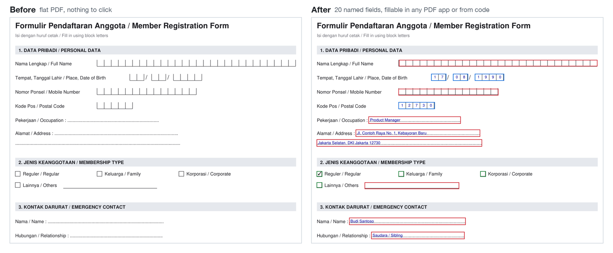
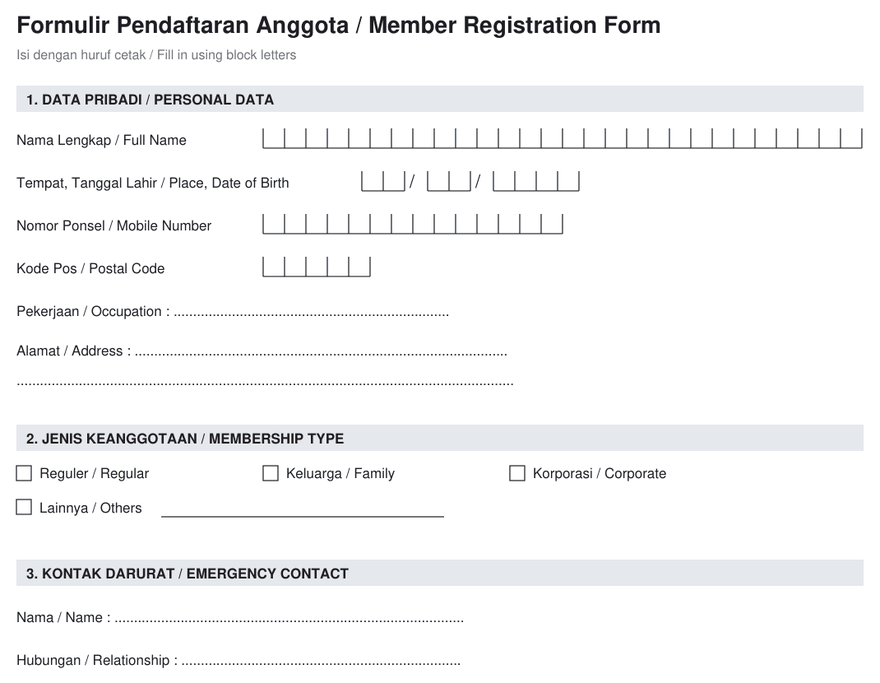

# acroformer

Turn flat PDF forms into fillable **AcroForms**. acroformer finds the printed
boxes, date cells, checkboxes and dotted lines, puts real form fields on top of
the untouched pages, and names every field after its printed label.



Many institutional forms (bank account openings, KYC packets, government
forms) are shipped as flat PDFs: the boxes are printed, but nothing can be
filled. The output of acroformer looks identical to the source and works in
Adobe Acrobat and Reader, macOS Preview, Chrome, or from code (PyMuPDF, pypdf,
pdftk).

## Install

```bash
pip install git+https://github.com/furyoktria/acroformer
```

Python 3.9 or newer. PyMuPDF is installed with it.

## Try it on the sample form

```bash
acroformer examples/sample-form.pdf --debug-overlay check.pdf
```



[`examples/sample-form.pdf`](examples/sample-form.pdf) is a fictional
bilingual form. [`sample-form-fillable.pdf`](examples/sample-form-fillable.pdf)
is what acroformer makes of it, and
[`sample-form-fields.json`](examples/sample-form-fields.json) is the field map.

## What it detects

| Printed geometry | Becomes |
|---|---|
| Rows of character boxes (`\|_\|_\|_\|...`) | One text field. Short runs such as dates and postal codes become **comb** fields (one character per box); long runs such as names become one free-flowing text field |
| Small square boxes with a label to the right | Checkbox |
| Single boxes separated by a printed `/` or `-` (dd / mm / yyyy) | Separate text boxes named `..._dd`, `..._mm`, `..._yyyy` |
| Dotted leaders (`.......`) and underscore runs | Text field |
| Drawn write-on lines (`Lainnya/Others ____`) | Text field |
| Empty bordered table cells and ruled table rows | Text field |

A few rules keep the output clean: checkboxes that contain pre-printed text are
skipped, fields inside shaded header cells (bank-use areas) are suppressed, and
overlapping candidates are merged.

## Field naming

Fields are named after the printed label next to them, so your integration code
stays readable. From the sample form:

```
p01_nama_lengkap
p01_tempat_tanggal_lahir_dd
p01_tempat_tanggal_lahir_mm
p01_tempat_tanggal_lahir_yyyy
p01_kode_pos
p01_alamat
p01_alamat_2      <- continuation line keeps the label
p01_reguler       <- checkbox, labeled by the text to its right
```

Checkboxes take the label to their right, text fields the label to their left
(falling back to the label line above). Bilingual labels such as
"Nama Lengkap / Full Name" keep the first part. The `pNN_` page prefix keeps
names unique across pages, and repeats get `_2`, `_3` and so on.

## Usage

```bash
acroformer input.pdf                       # writes input_acroform.pdf
acroformer input.pdf -o fillable.pdf
acroformer input.pdf --map fields.json     # JSON list of all fields
acroformer input.pdf --debug-overlay check.pdf
```

`--map` writes `[{name, page, type, maxlen, rect}, ...]`, which is handy for
building auto-fill integrations.

`--debug-overlay` writes a copy with colored outlines (red = text, blue = comb,
green = checkbox) so you can check the detection page by page.

Without installing, `python acroformer.py input.pdf` works the same way.

### Filling from code

```python
import fitz  # PyMuPDF

values = {"p01_kode_pos": "12730", "p01_pekerjaan": "Product Manager", "p01_reguler": True}

doc = fitz.open("examples/sample-form-fillable.pdf")
for w in doc[0].widgets():
    if w.field_name in values:
        v = values[w.field_name]
        w.field_value = w.on_state() if v is True else v
        w.update()
doc.save("filled.pdf")
```

## How it works

The detector reads the page's vector drawings (`page.get_drawings()`) and text
(`page.get_text("rawdict")`), then classifies the geometry:

1. **Vertical tick marks** are clustered into rows and split into runs at
   larger gaps and at printed glyphs, so `dd / mm / yyyy` splits into three.
2. Runs of 3 or more evenly spaced ticks become comb or text fields. Tick pairs
   are told apart by context: a `/` or `-` next to them means a date cell, and
   a letter or digit right after them means a checkbox. On many forms a
   checkbox and a 2-digit date box are geometrically identical.
3. Dotted leaders and underscores are found per character, so labels and
   fillers mixed in one text span still work.
4. Candidates are deduplicated, and widgets are added on top of the original,
   untouched pages.

Tested on a 67-page Indonesian account-opening packet with 667 fields. The
rules are generic, not tuned to one form.

## Limitations

- Wet-signature areas are left without fields on purpose.
- Radio-button groups are not inferred: exclusive choices come out as
  independent checkboxes.
- Detection is heuristic. Always look at `--debug-overlay` on a new form.

## License

MIT
